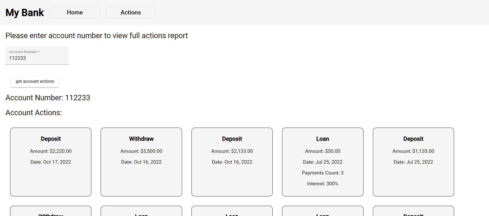
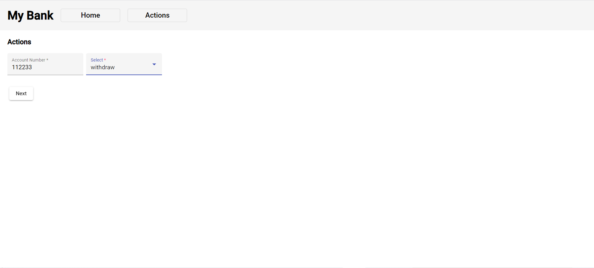

# Project Title

Bank management

## Description

On the site, you can follow all the accouts actions easily.<br>
You also can make some actions on your account!
<br><br>
Technologies I used in my project: Angular, Node.JS, MongoDB, Docker.

## Images

 


## Getting Started

### Dependencies

* NodeJS, Docker

### Installing

git clone my reposetory to your local folder.

### Executing program

* Open the terminal and run the following commands:
```
cd dev-apps
docker compose up
```
* Open new terminal and run the following commands:
```
cd apps\server
npm install
npm run all-slim
```
* Open another new terminal and run the following commands:
```
cd apps\client
npm install
npm start
```

## Help

If you running into a docker problem, check if the port 3306 of MySQL is available.
```
cd dev-apps
docker compose down 
```
after you make sure the port is available, run the following command in the dev-apps folder: 
```
cd dev-apps
docker compose up 
```

## Authors

Ziv Ashkenazi 
[@Linkdin](https://www.linkedin.com/in/ziv-ashkenazi/)
